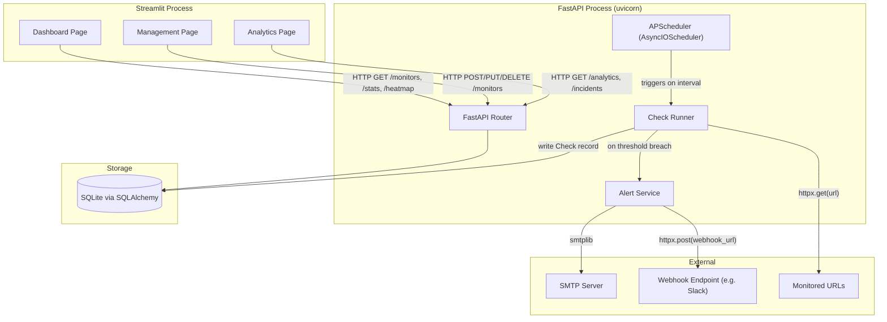

# Design Document: SitePulse

## Overview

SitePulse is a self-hosted site reliability monitor composed of three runtime layers:

1. **FastAPI backend** — REST API for monitor management, check data retrieval, and alert dispatch.
2. **APScheduler worker** — background job scheduler embedded in the FastAPI process that executes periodic health checks.
3. **Streamlit frontend** — single-page dashboard with three views (Dashboard, Management, Analytics) that polls the API.

All persistent state lives in a local SQLite database accessed via SQLAlchemy. Alerting is delivered over SMTP (email) and HTTP POST (webhook) using `httpx`. The system is designed to run as a single `uvicorn` process alongside a `streamlit` process, both on the same host.

---

## Architecture



### Key Design Decisions

- **Single process for API + scheduler**: APScheduler's `AsyncIOScheduler` runs inside the same event loop as FastAPI, avoiding inter-process communication. A startup/shutdown lifespan hook manages the scheduler lifecycle.
- **SQLite for simplicity**: Appropriate for a self-hosted, single-user tool. SQLAlchemy ORM provides a clean migration path to PostgreSQL if needed.
- **Streamlit polls the API**: The frontend never touches the database directly. All data flows through the REST API, keeping the UI stateless and the backend the single source of truth.
- **httpx for all outbound HTTP**: Used for both health checks and webhook delivery, with explicit timeout configuration.

---

## Components and Interfaces

### FastAPI Application (`app/main.py`)

Entry point. Registers routers, configures the SQLAlchemy engine, and manages the APScheduler lifespan.

```python
@asynccontextmanager
async def lifespan(app: FastAPI):
    init_db()
    scheduler.start()
    seed_existing_monitors()   # schedule jobs for all monitors in DB
    yield
    scheduler.shutdown()
```

### Routers

| Module | Prefix | Responsibility |
|---|---|---|
| `app/routers/monitors.py` | `/monitors` | CRUD for Monitor resources |
| `app/routers/checks.py` | `/monitors/{id}/checks` | Check history, latency, uptime |
| `app/routers/heatmap.py` | `/monitors/{id}/heatmap` | 90-day hourly heatmap data |
| `app/routers/analytics.py` | `/analytics` | System-wide latency trends, incident log |

### Check Runner (`app/worker/runner.py`)

Executes a single health check for a given monitor. Called by the scheduler job.

```python
async def run_check(monitor_id: str) -> None:
    # 1. Load monitor from DB
    # 2. Execute HTTP request with httpx (timeout=30s)
    # 3. Evaluate success criteria (status code match, JSON assertion)
    # 4. Persist Check record
    # 5. Update consecutive_failure_count on Monitor
    # 6. Trigger alerts if threshold reached
```

A per-monitor asyncio lock prevents duplicate concurrent checks (Requirement 3.5).

### Scheduler Service (`app/worker/scheduler.py`)

Thin wrapper around `APScheduler.AsyncIOScheduler`.

```python
def add_monitor_job(monitor: Monitor) -> None: ...
def remove_monitor_job(monitor_id: str) -> None: ...
def reschedule_monitor_job(monitor: Monitor) -> None: ...
```

### Alert Service (`app/services/alerts.py`)

Dispatches email and webhook notifications.

```python
async def dispatch_alert(monitor: Monitor, last_check: Check) -> None:
    if monitor.alert_email:
        await send_email_alert(monitor, last_check)
    if monitor.webhook_url:
        await send_webhook_alert(monitor, last_check)
```

### Streamlit App (`sitepulse_app.py`)

Three-page app with sidebar navigation. Calls the FastAPI backend via `httpx` (or `requests`). Uses `st.rerun()` with a countdown timer for auto-refresh.

---

## Data Models

### SQLAlchemy ORM Models (`app/models.py`)

```python
class Monitor(Base):
    __tablename__ = "monitors"

    id: Mapped[str]                    # UUID, primary key
    name: Mapped[str]                  # display name
    url: Mapped[str]                   # validated HTTP/HTTPS URL
    interval_minutes: Mapped[int]      # [1, 1440]
    expected_status_code: Mapped[int | None]   # e.g. 200; None = any 2xx
    json_assert_key: Mapped[str | None]        # key for JSON body assertion
    json_assert_value: Mapped[str | None]      # expected value
    alert_email: Mapped[str | None]
    webhook_url: Mapped[str | None]
    failure_threshold: Mapped[int]     # default 3, range [1, 10]
    consecutive_failures: Mapped[int]  # current streak, reset on success
    alert_suppressed: Mapped[bool]     # True after alert fired, until success
    created_at: Mapped[datetime]

class Check(Base):
    __tablename__ = "checks"

    id: Mapped[str]                    # UUID, primary key
    monitor_id: Mapped[str]            # FK -> monitors.id (cascade delete)
    timestamp: Mapped[datetime]
    success: Mapped[bool]
    http_status_code: Mapped[int | None]
    response_time_ms: Mapped[int | None]   # None on network error/timeout
    failure_reason: Mapped[str | None]     # "timeout" | "connection_error" | "status_mismatch" | "json_assertion_failed"
```

### Pydantic Schemas (`app/schemas.py`)

```python
class MonitorCreate(BaseModel):
    name: str
    url: HttpUrl                       # Pydantic validates HTTP/HTTPS
    interval_minutes: int = Field(ge=1, le=1440)
    expected_status_code: int | None = None
    json_assert_key: str | None = None
    json_assert_value: str | None = None
    alert_email: EmailStr | None = None
    webhook_url: HttpUrl | None = None
    failure_threshold: int = Field(default=3, ge=1, le=10)

class MonitorRead(MonitorCreate):
    id: str
    consecutive_failures: int
    alert_suppressed: bool
    created_at: datetime

class CheckRead(BaseModel):
    id: str
    monitor_id: str
    timestamp: datetime
    success: bool
    http_status_code: int | None
    response_time_ms: int | None
    failure_reason: str | None

class HeatmapCell(BaseModel):
    hour: datetime                     # UTC, truncated to hour
    status: Literal["up", "degraded", "down", "no_data"]
    uptime_pct: float | None
    avg_latency_ms: float | None

class HeatmapResponse(BaseModel):
    monitor_id: str
    cells: list[HeatmapCell]           # 2160 entries (90 days * 24 hours)

class UptimeStats(BaseModel):
    monitor_id: str
    window_hours: int
    uptime_pct: float | None
    avg_latency_ms: float | None
    total_checks: int
    successful_checks: int
```

---

## API Endpoint Design

### Monitors

| Method | Path | Description | Success | Error |
|---|---|---|---|---|
| `GET` | `/monitors` | List all monitors | 200 `list[MonitorRead]` | — |
| `POST` | `/monitors` | Create monitor | 201 `MonitorRead` | 422 validation |
| `GET` | `/monitors/{id}` | Get single monitor | 200 `MonitorRead` | 404 |
| `PUT` | `/monitors/{id}` | Update monitor | 200 `MonitorRead` | 404, 422 |
| `DELETE` | `/monitors/{id}` | Delete monitor + checks | 204 | 404 |

### Checks & Stats

| Method | Path | Description |
|---|---|---|
| `GET` | `/monitors/{id}/checks` | Check history; query params: `start`, `end` (ISO datetime) |
| `GET` | `/monitors/{id}/stats` | Returns `UptimeStats` for `window_hours` query param (default 24) |

### Heatmap

| Method | Path | Description |
|---|---|---|
| `GET` | `/monitors/{id}/heatmap` | Returns `HeatmapResponse` with 2160 `HeatmapCell` entries |

### Analytics

| Method | Path | Description |
|---|---|---|
| `GET` | `/analytics/latency` | System-wide avg latency per hour for last 24h, all monitors |
| `GET` | `/analytics/incidents` | Recent failed checks grouped as incidents, last 7 days |

---

## Background Worker Design

### Scheduler Lifecycle

```
FastAPI startup
  └─ AsyncIOScheduler.start()
  └─ for each Monitor in DB: add_job(run_check, 'interval', minutes=m.interval_minutes, id=m.id)

Monitor created via API
  └─ add_job(run_check, 'interval', minutes=interval, id=monitor.id)

Monitor deleted via API
  └─ remove_job(monitor.id)

Monitor updated via API (interval changed)
  └─ reschedule_job(monitor.id, trigger='interval', minutes=new_interval)
```

### Duplicate Check Prevention

Each monitor has an associated `asyncio.Lock` stored in a module-level dict keyed by monitor ID. `run_check` acquires the lock with `lock.acquire(blocking=False)`. If the lock is already held, the invocation returns immediately without executing the check.

```python
_check_locks: dict[str, asyncio.Lock] = {}

async def run_check(monitor_id: str) -> None:
    lock = _check_locks.setdefault(monitor_id, asyncio.Lock())
    if not lock.locked():
        async with lock:
            await _execute_check(monitor_id)
```

### Check Execution Flow

```
1. Load Monitor from DB
2. async with httpx.AsyncClient(timeout=30.0) as client:
       response = await client.get(monitor.url)
3. Evaluate success:
   a. If expected_status_code set: success = (response.status_code == expected)
   b. Else: success = (200 <= response.status_code < 300)
   c. If json_assert_key set: parse body, check body[key] == value
4. Persist Check(success, http_status_code, response_time_ms, failure_reason)
5. If success:
       monitor.consecutive_failures = 0
       monitor.alert_suppressed = False
   Else:
       monitor.consecutive_failures += 1
       if consecutive_failures >= failure_threshold and not alert_suppressed:
           await dispatch_alert(monitor, check)
           monitor.alert_suppressed = True
6. Commit DB session
```

---

## Alerting Subsystem

### Email (`app/services/email_alert.py`)

Uses Python's `smtplib` with configuration from environment variables:

| Env Var | Description |
|---|---|
| `SMTP_HOST` | SMTP server hostname |
| `SMTP_PORT` | Port (default 587) |
| `SMTP_USERNAME` | Auth username |
| `SMTP_PASSWORD` | Auth password |
| `SMTP_FROM` | Sender address |

Email body template:

```
Subject: [SitePulse Alert] {monitor.name} is DOWN

Monitor:   {monitor.name}
URL:       {monitor.url}
Failures:  {monitor.consecutive_failures} consecutive
Last fail: {last_check.timestamp} UTC

SitePulse — Professional Site Reliability Monitor
```

### Webhook (`app/services/webhook_alert.py`)

Uses `httpx.AsyncClient` with a 10-second timeout. Payload:

```json
{
  "monitor_name": "Production API",
  "url": "https://api.myapp.com/v1",
  "consecutive_failures": 3,
  "last_failed_at": "2024-05-21T14:02:00Z",
  "event": "threshold_reached"
}
```

Non-2xx responses and timeouts are caught and logged with `monitor_id`, `webhook_url`, and the error detail. Failures do not raise exceptions — alerting is best-effort.

---

## Streamlit UI Component Design

### Layout and Navigation

```
Sidebar
├── Title: "📡 SitePulse"
├── Caption: "Professional Site Reliability Monitor"
├── Divider
├── st.radio("Navigation", ["Dashboard", "Management", "Analytics"])
├── Divider
└── System Status
    ├── st.success("Internal Monitor: ACTIVE")  ← green badge
    └── st.info(f"Next Sync: In {countdown}s")  ← blue badge, counts down
```

Auto-refresh is implemented with `time.sleep(1)` + `st.rerun()` inside a countdown loop, capped at 60 seconds.

### Dashboard Page (`show_dashboard`)

**Global metrics row** — 4 `st.columns`:

| Column | Metric | Source |
|---|---|---|
| 1 | Total Services | `len(monitors)` |
| 2 | Healthy | `count(status == "online")` |
| 3 | Avg Latency | mean of all monitors' 24h avg latency |
| 4 | Incidents (24h) | count of failed checks in last 24h |

**Per-monitor cards** — `st.container(border=True)` with 3 columns `[1.5, 3, 0.5]`:

```
col_info (1.5)
├── ### <status-dot> {name}          ← colored dot via inline HTML
├── st.caption(url)
├── sub-columns [1, 1]:
│   ├── Uptime: {uptime}%
│   └── Latency: {latency}ms

col_history (3)
├── "**90 Day Availability**"
├── render_heatmap(history)           ← HTML div row (see below)
└── st.caption("Each bar represents 1 hour of aggregated availability data.")

col_action (0.5)
├── st.button("⚙️", key=f"edit_{id}")
└── st.button("📊", key=f"stat_{id}")
```

**Status dot CSS classes:**

| Status | Class | Color | Glow |
|---|---|---|---|
| online | `dot-online` | `#10b981` | `box-shadow: 0 0 8px #10b981` |
| warning | `dot-warning` | `#f59e0b` | `box-shadow: 0 0 8px #f59e0b` |
| offline | `dot-offline` | `#ef4444` | `box-shadow: 0 0 8px #ef4444` |

### Heatmap Rendering (`render_heatmap`)

The heatmap is rendered as a row of inline HTML `<div>` elements. Each cell maps to one hourly `HeatmapCell` from the API.

**Cell dimensions:** 12px wide × 24px tall, 2px border-radius, 1px margin.

**Color mapping:**

| Status | Color |
|---|---|
| `up` | `#10b981` (green) |
| `degraded` | `#f59e0b` (amber) |
| `down` | `#ef4444` (red) |
| `no_data` | `#e2e8f0` (grey) |

```python
def render_heatmap(cells: list[HeatmapCell]) -> None:
    html = '<div style="display: flex; flex-wrap: wrap; gap: 1px;">'
    color_map = {
        "up": "#10b981",
        "degraded": "#f59e0b",
        "down": "#ef4444",
        "no_data": "#e2e8f0",
    }
    for cell in cells:
        color = color_map[cell.status]
        tooltip = f"{cell.hour.strftime('%Y-%m-%d %H:00')} | {cell.status}"
        html += (
            f'<div class="heatmap-cell" '
            f'style="background-color:{color};" '
            f'title="{tooltip}"></div>'
        )
    html += "</div>"
    st.markdown(html, unsafe_allow_html=True)
```

The Dashboard page fetches heatmap data from `GET /monitors/{id}/heatmap` and passes the `cells` list to `render_heatmap`.

### Management Page (`show_management`)

**Add New Service form** inside `st.expander("➕ Add New Service", expanded=True)`:

```
st.form("new_service")
├── col_a: text_input("Service Name")
├── col_b: text_input("Target URL")
├── col_c: select_slider("Check Interval", options=[1,5,10,15,30,60], value=5)
├── col_d: text_input("Alert Email")
└── form_submit_button("Initialize Monitor", use_container_width=True)
    └── POST /monitors → st.success(f"Monitoring {url} every {interval} minutes")
```

**Existing Targets table**: `st.table(df[['name','url','status','uptime']])` populated from `GET /monitors`.

### Analytics Page (`show_analytics`)

**System-Wide Latency Trends** — full-width Plotly area chart:

```python
fig = go.Figure()
fig.add_trace(go.Scatter(
    x=times,
    y=latencies,
    fill='tozeroy',
    line_color='#3b82f6',
    name='Latency (ms)'
))
fig.update_layout(
    xaxis_title="Time",
    yaxis_title="Latency (ms)",
    template="plotly_dark",   # matches dark theme
    hovermode="x unified",
    margin=dict(l=20, r=20, t=40, b=20),
)
st.plotly_chart(fig, use_container_width=True)
```

Data sourced from `GET /analytics/latency`.

**Incident Log table**: `st.table(incidents)` with columns: Timestamp, Service, Event, Severity. Data from `GET /analytics/incidents`.

---

## Heatmap Data Structure and Computation

### API-Side Computation

The heatmap endpoint computes 2160 hourly buckets (90 days × 24 hours) in a single DB query:

```sql
SELECT
    strftime('%Y-%m-%dT%H:00:00', timestamp) AS hour,
    SUM(CASE WHEN success = 1 THEN 1 ELSE 0 END) AS successes,
    COUNT(*) AS total,
    AVG(response_time_ms) AS avg_latency
FROM checks
WHERE monitor_id = :monitor_id
  AND timestamp >= :cutoff
GROUP BY hour
```

Classification logic (pure Python, no DB):

```python
def classify_hour(successes: int, total: int) -> str:
    if total == 0:
        return "no_data"
    if successes == total:
        return "up"
    if successes == 0:
        return "down"
    return "degraded"
```

The endpoint then fills in all 2160 slots, inserting `no_data` cells for hours with no DB rows, ensuring the response always has exactly 2160 entries ordered oldest-first.

---

## Correctness Properties

*A property is a characteristic or behavior that should hold true across all valid executions of a system — essentially, a formal statement about what the system should do. Properties serve as the bridge between human-readable specifications and machine-verifiable correctness guarantees.*

Property-based testing is applicable here because SitePulse contains several pure functions and business logic layers (URL validation, uptime calculation, heatmap classification, alert suppression, check result evaluation) where input variation meaningfully exercises edge cases. The `hypothesis` library will be used for Python property-based testing, configured with `@settings(max_examples=100)`.

### Property 1: URL validation rejects non-HTTP/HTTPS strings

*For any* string that is not a well-formed HTTP or HTTPS URL, attempting to create a Monitor with that string as the URL should return a 422 validation error. Conversely, for any well-formed `http://` or `https://` URL, creation should succeed.

**Validates: Requirements 1.3, 1.4**

### Property 2: Monitor IDs are unique across all created monitors

*For any* sequence of N valid Monitor creation requests, all N assigned IDs should be pairwise distinct — no two monitors share the same identifier.

**Validates: Requirements 1.5**

### Property 3: Cascade delete removes all associated checks

*For any* monitor with any number of associated Check records, deleting that monitor should result in zero Check records remaining for that monitor's ID.

**Validates: Requirements 1.6**

### Property 4: Interval range validation

*For any* integer outside the range [1, 1440], a Monitor creation or update request with that interval should return a 422 error. For any integer within [1, 1440], the request should succeed.

**Validates: Requirements 1.7, 1.8**

### Property 5: Check success evaluation is determined solely by response vs. expectation

*For any* configured expected status code E and any actual HTTP response status code A, the check result should be `success` if and only if `E == A`. When no expected code is configured, success holds if and only if `200 <= A < 300`.

**Validates: Requirements 2.2**

### Property 6: JSON assertion evaluation

*For any* key-value assertion `(k, v)` and any JSON response body `B`, the check result should be `success` if and only if `B` contains key `k` with value equal to `v`.

**Validates: Requirements 2.3**

### Property 7: Completed check records contain all required fields

*For any* check execution (success or failure), the persisted Check record should contain non-null values for `timestamp`, `success`, and `monitor_id`. On success, `http_status_code` and `response_time_ms` should be non-null. On failure, `failure_reason` should be non-null.

**Validates: Requirements 2.6**

### Property 8: Uptime percentage formula correctness

*For any* list of Check records with S successes out of T total checks (T > 0), the computed uptime percentage should equal `(S / T) * 100`, within floating-point tolerance. When T = 0, the result should be `null`.

**Validates: Requirements 5.1, 5.4**

### Property 9: Average latency formula correctness

*For any* non-empty list of response times, the computed average latency should equal the arithmetic mean of all values. When the list is empty, the result should be `null`.

**Validates: Requirements 4.2, 4.3, 4.4**

### Property 10: Failure threshold range validation

*For any* integer outside [1, 10], setting the failure threshold on a Monitor should return a 422 error. For any integer within [1, 10], it should succeed.

**Validates: Requirements 6.1**

### Property 11: Alert fires exactly at threshold and is then suppressed

*For any* monitor with failure threshold T, after exactly T consecutive failed checks, exactly one alert should have been dispatched. After the alert fires, any additional consecutive failures (without an intervening success) should not dispatch additional alerts.

**Validates: Requirements 6.2, 6.3**

### Property 12: Successful check resets consecutive failure count

*For any* monitor with any consecutive failure count N ≥ 0, recording a successful check should set `consecutive_failures` to 0 and set `alert_suppressed` to `False`.

**Validates: Requirements 6.4**

### Property 13: Alert notification payload contains all required fields

*For any* monitor with any name, URL, consecutive failure count, and last-failed timestamp, the generated email body and webhook JSON payload should each contain all four of those values.

**Validates: Requirements 7.2, 8.2**

### Property 14: Heatmap classification is exhaustive and correct

*For any* hour bucket with S successes and T total checks:
- T = 0 → `no_data`
- T > 0, S = T → `up`
- T > 0, S = 0 → `down`
- T > 0, 0 < S < T → `degraded`

No other classification should be possible.

**Validates: Requirements 9.2**

### Property 15: Heatmap response always contains exactly 2160 cells

*For any* monitor (regardless of how many checks exist), the heatmap endpoint should return exactly 2160 `HeatmapCell` entries covering the last 90 days, with no gaps or duplicates in the hourly sequence.

**Validates: Requirements 9.1**

### Property 16: Check time-window filter excludes out-of-range records

*For any* time window `[start, end]` and any set of Check records, the checks endpoint should return only records whose `timestamp` falls within `[start, end]` inclusive.

**Validates: Requirements 4.1**

---

## Error Handling

| Scenario | Handling |
|---|---|
| Monitor not found | 404 with `{"detail": "Monitor not found"}` |
| Invalid URL on create/update | 422 from Pydantic `HttpUrl` validation |
| Interval out of range | 422 from Pydantic `Field(ge=1, le=10)` |
| Check HTTP timeout (30s) | Record `Check(success=False, failure_reason="timeout")` |
| Check network error | Record `Check(success=False, failure_reason="connection_error")` |
| Check JSON parse error | Record `Check(success=False, failure_reason="json_parse_error")` |
| Email delivery failure | Log `ERROR monitor_id={id} smtp_error={reason}`, do not raise |
| Webhook non-2xx | Log `ERROR monitor_id={id} webhook_url={url} status={code}`, do not raise |
| Webhook timeout (10s) | Log `ERROR monitor_id={id} webhook_url={url} reason=timeout`, do not raise |
| Duplicate check in-flight | Skip silently via lock check |
| DB constraint violation | 500 with logged traceback (unexpected; schema prevents most cases) |

All alerting failures are logged and swallowed — a broken SMTP server or webhook endpoint must never crash the check runner or the API.

---

## Testing Strategy

### Unit Tests (pytest)

Focus on pure functions and business logic:

- URL validation edge cases (bare domains, `ftp://`, empty string, IP addresses)
- `classify_hour(successes, total)` for all four branches
- Uptime percentage formula with known inputs
- Average latency formula with known inputs
- Alert suppression state machine transitions
- Email body template rendering
- Webhook payload serialization

### Property-Based Tests (hypothesis, `@settings(max_examples=100)`)

Each property test references its design property via a comment tag:
`# Feature: sitepulse, Property {N}: {property_text}`

Properties 1, 4, 5, 6, 7, 8, 9, 10, 11, 12, 13, 14, 15, 16 are implemented as property-based tests. Properties 2 and 3 are tested with example-based integration tests (ID uniqueness and cascade delete are DB-level behaviors better verified with concrete scenarios).

### Integration Tests

- Full CRUD lifecycle for Monitor via the FastAPI test client
- Check runner end-to-end with a mocked `httpx` response
- Alert dispatch with mocked SMTP and webhook endpoints
- Scheduler job registration/removal on monitor create/delete

### Smoke Tests

- API starts and all routes are registered
- Scheduler starts and seeds jobs for existing monitors
- SMTP configuration is read from environment variables
- Dashboard auto-refresh interval is ≤ 60 seconds
